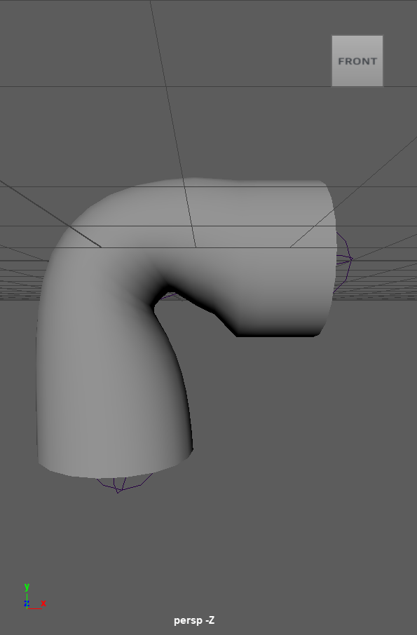
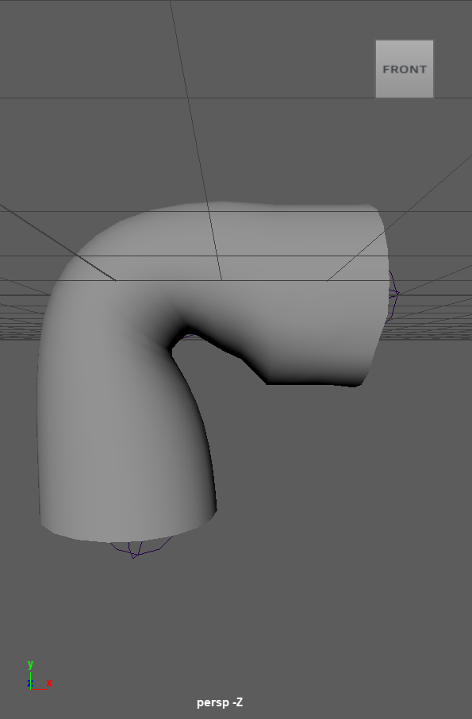

# HRBF(Hermite Radial Basis Functions) Skinning Maya Tool

This tool provides an advanced skinning solution within Maya using Hermite Radial Basis Functions (HRBF). It offers more natural and realistic deformations compared to traditional skinning methods, making it particularly useful for complex character rigs in animation and visual effects.

## Features

- **Natural Deformation**: Achieve smoother and more realistic skin deformations, minimizing common issues like the "candy wrapper" effect.
- **Volume Preservation**: Maintain consistent volume during joint bends, preventing unnatural volume loss.
 - **Reduced Manual Adjustments**: Automatically calculate weights for more natural deformations, reducing the need for manual tweaking.


## Installation

1. **Building the Plugin**：
    -   Clone the Repository:
        - `git clone https://github.com/Ding-Jia-Layla/HRBF-Skinning-Maya-Tool.git`
    -  Build the plug-in
        - cmake -H. -B<build_directory> -G <generator>
        - Take windows for example:
        ```
            # mkdir build
            # cmake -S. -Bbuild -G "Visual Studio 17 2022" 
            # cmake --build build
        ```
2. **Installing the Plugin**:
    - Copy the Plugin to Maya's Plugin Directory:
        - Copy the plugin file(`add-buildHRBF-finalAdjust.mll`) to the Maya plugins directory:
            - `Windows: C:/Program Files/Autodesk/Maya<version>/bin/plug-ins/`
            - `macOS/Linux: /Applications/Autodesk/maya<version>/Maya.app/Contents/plug-ins/`
## Usage
- Load the Plugin in Maya:
    - Run `originalSkinCluster.py` to create the original model and skinCluster.
    - Run `convert.mel` to replace the original skinning tool.
## Example
- Check the `example/skin.mp4`
- The compiled plugin `build` folder is provided and can be used directly.
- Comparison with custom skinning
    <p align="center">
    <figure style="display: inline-block; margin: 10px;">
        
        <figcaption>LBS</figcaption>
    </figure>
    <figure style="display: inline-block; margin: 10px;">
        
        <figcaption>HRBF</figcaption>
    </figure>
</p>